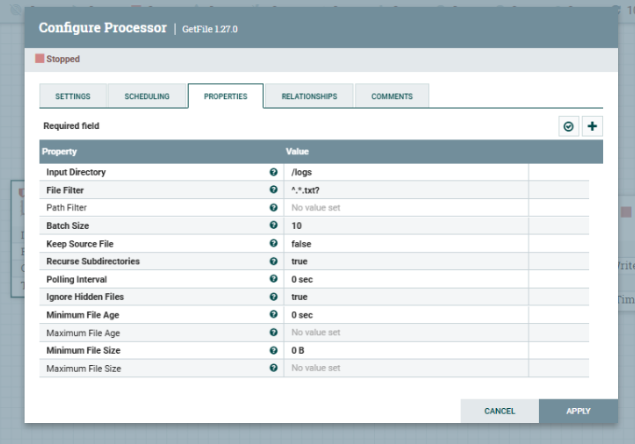
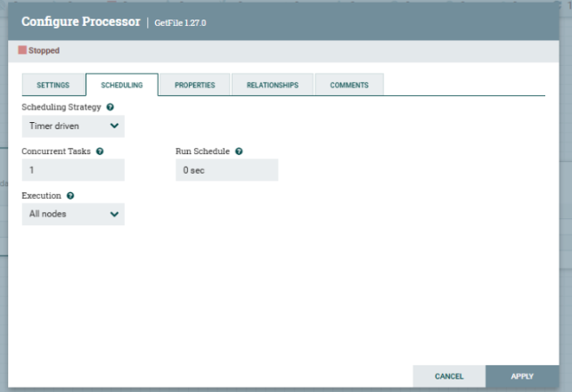
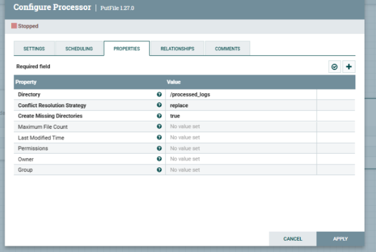

# E-Commerce Analytics Dashboard

This project demonstrates the use of various data engineering tools to process and analyze logs generated by an e-commerce site. The primary objective of this project is to showcase the use of Apache Nifi for data ingestion and processing, Apache Spark for data aggregation, and a Python Flask application to present the data in a dashboard for decision-making purposes.

### Prerequisites

- Docker (for running Apache Nifi and Spark containers)
- Python 3.x
- Node.js (for the backend server)
- Apache Spark (for log processing)
- Flask (for the dashboard)
- Matplotlib (for data visualization)

### 1. **Run the Frontend**

To run the frontend, navigate to the frontend directory and start a simple HTTP server to serve the static files (HTML, CSS, JS)

### 2. **Run the Backend Server**

To start the backend server (Node.js), run the following command:

```bash
node backend/script.js
```

### 3. **Run Apache Nifi**

To start Apache Nifi, use the following Docker command:

```bash
docker run -p 8443:8443 -v "/backend/logs:/logs" -v "/backend/processed_logs:/processed-logs" --name nifi-container apache/nifi:latest
```

Two NiFi processors must be configured to handle log data import and export.

### **GetFile Processor** :

This processor will read the files (logs or images) from a specified directory.



### **PutFile Processor** :

This processor will output processed files to the specified directory.


### 4. **Run the Spark Script**

To run the Spark script manually for log processing, execute the following Docker command. This will process the logs stored in the folder /logs using Spark and save the output in the ./output/ directory:

```bash
docker run -it -v /backend:/app" bitnami/spark:latest spark-submit /app/process_logs.py
```

### 5. **Schedule the Spark Process**

To schedule the Spark process to run every hour, execute the following command to run the scheduler script:

```bash
python backend/schedule-spark-process.py
```

### 6. **Run the Dashboard (Flask Application)**

To run the dashboard and access it at http://localhost:5000, execute the following command:

```bash
python backend/dashboard.py
```
